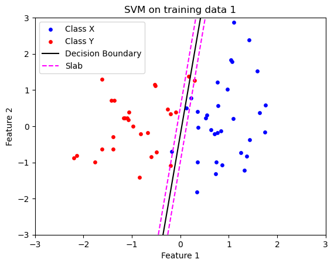

## Overview

This repository contains the implementation and analysis of machine learning techniques for pattern recognition and classification problems. Given two sets of points in $\mathbb{R}^n$, the goal is to find a function $f : \mathbb{R}^n \to \mathbb{R}$ that can accurately classify these points into distinct categories.

This code deals with geometric problems, and the work is based on the theory from Section 8.6:Classification of the Convex Optimisation book by Stephen Boyd.

### Problem Statement

We have two sets of points:
- $\{x_1,\dots,x_N\}$
- $\{y_1,\dots,y_M\}$

The objective is to find a function $f$ that satisfies:

$$
f(x_i) > 0,\quad i = 1,\dots,N, \qquad f(y_i) < 0,\quad i = 1, \dots ,M.
$$

If $f$ achieves this, it effectively separates or classifies the two sets of points.

There are four datasets of differing complexity. Support Vector Machines, Logistic Models, and polynomial kernels are all fitted by solving convex optimisation problems, without using any ML libraries.


## Implementation

The repository includes the implementation of the following classification methods:

1. **Support Vector Machine (SVM)**
2. **Logistic Modeling**

### Dependencies

- Python 3.7+
- CVXPY
- NumPy
- Matplotlib

### Data

The datasets used for training and testing are loaded from CSV files:
- `X_train.csv`
- `Y_train.csv`
- `X_test.csv`
- `Y_test.csv`

### SVM Classifier

The SVM classifier is implemented to determine a standard support vector classifier with parameter tuning capabilities. 

```python
# Function to solve the SVM classifier optimization problem
def svm_classifier(X, Y, gamma):
    # Implementation details...
```

### Logistic Modeling

A logistic modeling approach is also implemented to approximate a linear classifier.

```python
# Function for logistic modeling classification
def logistic_modelling_classifier(X, Y):
    # Implementation details...
```

### Visualization

Functions are provided to plot the results of the classifiers, illustrating the decision boundaries and classification regions.
Some example images can be seen below:

The following image demonstrates the classification boundaries defined by our SVM model:




## Analysis and Results

The performance of the classifiers is evaluated using various metrics, including accuracy, precision, recall, and F1 score. The classifiers are tested on different datasets to assess their effectiveness in various scenarios.

### Classifier Performance

The performance of each classifier is rigorously tested on both training and test datasets, providing insights into their generalization capabilities.

## Conclusion

This project demonstrates the application of SVM and logistic modeling in classifying multidimensional data points. The results indicate the effectiveness of these methods in pattern recognition and their varying performance based on the nature of the dataset.


Disclaimer : I have used Chat GPT to help generate the readme.